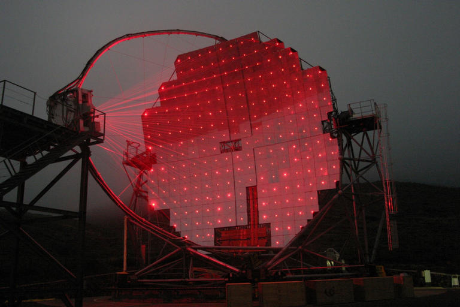

# **Gamma & Hadron Ray Classification Project**

## **Documentation**

### **MAGIC Gamma Telescope Dataset Analysis**

- This repository contains analysis and classification techniques applied to the MAGIC Gamma Telescope dataset, which was donated on April 30, 2007. 

- This dataset simulates high-energy gamma-ray and hadron particle interactions in a ground-based atmospheric Cherenkov telescope. The MAGIC (**Major Atmospheric Gamma Imaging Cherenkov**) telescope captures extensive air showers generated by these particles, 

- Using advanced imaging techniques for discrimination between gamma-ray and hadronic events.

### **Dataset Overview**

- **Data Source**: MAGIC Gamma Telescope
- **Instances**: 19,020
- **Features**: 10 real-valued, continuous features with no missing values
- **Associated Tasks**: Classification (Hadron vs. Gamma)
| Variable   | Description                                         | Units |
|------------|-----------------------------------------------------|-------|
| **fLength**  | Major axis of ellipse                               | mm    |
| **fWidth**   | Minor axis of ellipse                               | mm    |
| **fSize**    | Logarithmic sum of pixel content                    |       |
| **fConc**    | Ratio of sum of two highest pixels over *fSize*     |       |
| **fConc1**   | Ratio of highest pixel over *fSize*                 |       |
| **fAsym**    | Distance from highest pixel to center, projected on major axis | |
| **fM3Long**  | Third root of third moment along major axis         | mm    |
| **fM3Trans** | Third root of third moment along minor axis         | mm    |
| **fAlpha**   | Angle of major axis with vector to origin           | deg   |
| **fDist**    | Distance from origin to ellipse center              | mm    |

- The data was generated using the **CORSIKA Monte Carlo program**, which simulates air showers and allows for detailed particle event analysis down to energies below 50 GeV. 

- This dataset is ideal for exploring techniques in particle physics classification and studying the characteristics of gamma and hadron events.

### **Objectives**
- **Classify** events into Gamma or Hadron using multivariate analysis.
- **Explore** the underlying physical characteristics of particle showers in Cherenkov telescopes.

This project focuses on classifying gamma-ray and hadronic events using data from the MAGIC (Major Atmospheric Gamma Imaging Cherenkov) telescope. The dataset simulates particle interactions in an atmospheric Cherenkov telescope, allowing us to analyze and differentiate between gamma and hadronic events based on image-derived features.

### **Project Overview**

- The primary goal of this project is to build a classification model that can accurately distinguish between gamma and hadron events, leveraging the 10 continuous features derived from Cherenkov images. 

- This involves preprocessing, feature engineering, and applying machine learning techniques to achieve optimal classification performance.

### **Steps**

1. **Data Preprocessing**: Cleaning and normalizing data, feature scaling.
2. **Exploratory Data Analysis**: Visualizing and analyzing feature distributions and correlations.
3. **Modeling**: Building classification models such as Logistic Regression, SVM, Random Forest, etc.
4. **Evaluation**: Assessing model performance with metrics like accuracy, precision, recall, and F1-score.
5. **Optimization**: Tuning hyperparameters for improved performance.

## **Authors**

- [@pri-cd](https://www.github.com/pri-cd)

## **Badges**

